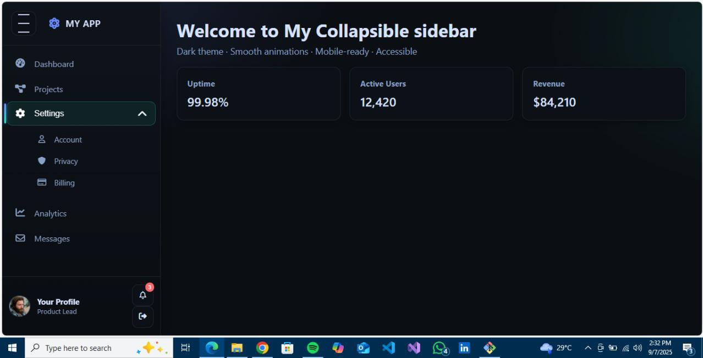
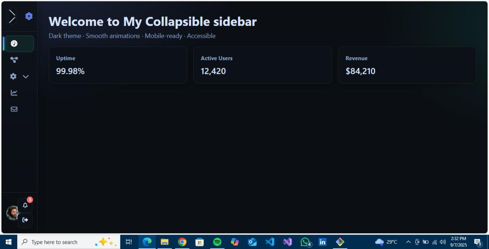

# 📂 Collapsible Sidebar

A **responsive and interactive collapsible sidebar** built using **HTML, CSS, and JavaScript**.
This project was created as part of my **Frontend Development Internship Task at @Elevvo Pathways** 🖥️✨.

---

## 🚀 Features

✅ **Expandable & Collapsible** sidebar navigation
✅ **Smooth animations** for transitions
✅ **Responsive design** for mobile & desktop
✅ **Active state highlighting** for selected menu items
✅ **Clean & customizable** structure for easy updates

---

## 🛠️ Tech Stack

* 🏗️ **HTML5** – Page structure
* 🎨 **CSS3** – Styling & transitions
* ⚡ **JavaScript** – Sidebar toggle functionality

---

## 📂 Project Structure

```bash
📦 collapsible-sidebar
 ┣ 📜 index.html      # Main HTML file
 ┣ 📜 style.css       # Sidebar styling & responsiveness
 ┣ 📜 script.js       # Toggle functionality
 ┗ 📜 README.md       # Documentation
```

---

## ⚡ How It Works

1️⃣ The sidebar is **expanded by default**.
2️⃣ Clicking the **☰ hamburger menu button** toggles it between **expanded ↔ collapsed**.
3️⃣ The main content area **adjusts automatically** to fit the layout.

---

## 📸 Screenshots

### ▶️ Expanded Sidebar

  

### ◀️ Collapsed Sidebar

  

---

## 🔧 Installation & Usage

1. Clone this repository ⬇️

   ```bash
   git clone https://github.com/your-username/collapsible-sidebar.git
   ```
2. Move into the project folder 📂

   ```bash
   cd collapsible-sidebar
   ```
3. Open **index.html** in your browser 🌐

---

## 🚧 Future Improvements

✨ Add **dark/light mode** toggle
✨ Implement **nested submenus**
✨ Enhance **keyboard accessibility**

---

## 👨‍💻 Author

Developed by **Hina Hanif** as part of my **Frontend Development Internship** 💼

---

